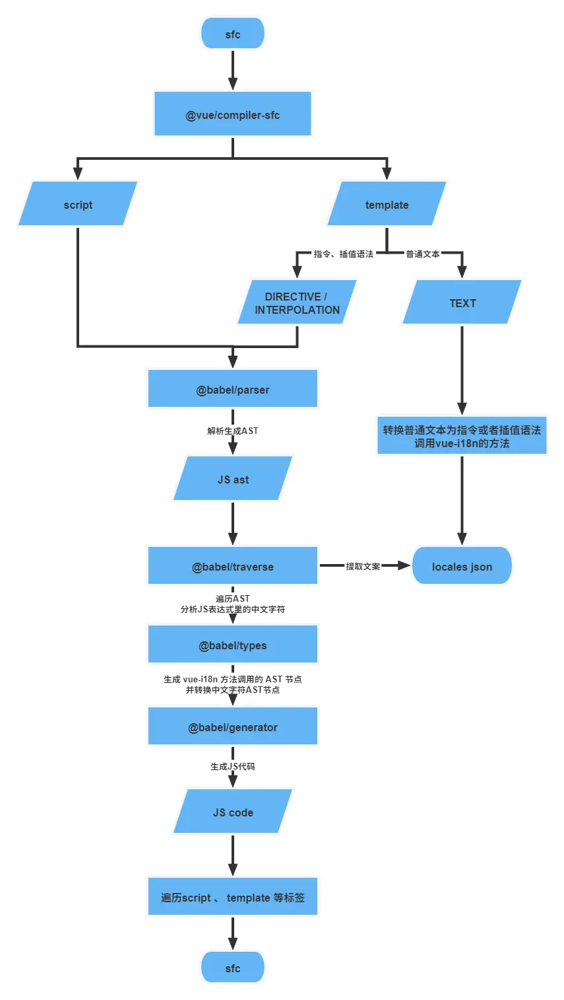

## 抓取vue文件中的中文词条替换为i18n



### 使用介绍

- 将整个项目copy到和你项目src平级的地方，
- 将src/index.js 中的
  `handleFileDirPath`更改为自己需要提取的文件路径
- 将src/utils.js 中的`allLange`更改为自己的词条库路径
  词条库的格式为

  ```javascript
  ;[
    { value: 'Operation', key: '操作' },
    { value: 'Delete', key: '删除' },
    { value: 'Modify', key: '修改' },
    { value: 'Edit', key: '编辑' },
    { value: 'Query', key: '查询' },
    { value: 'Reset', key: '重置' }
  ]
  ```

  `generateHash` 方法为生产`key` 的规则，可根据实际项目调整

- 启动运行 **会在你源文件上进行国际化替换**
- 结束后 会有生产三个文件
  `locale-cn.json` 中文词条
  `locale-en.json` 英文词条
  `no-en-lang.json` 没有在`allLange`中找到的词条

- 最后可以根据 `no-en-lang.json` 补充`allLange`词条 再次运行项目 完成全部国际化替换
